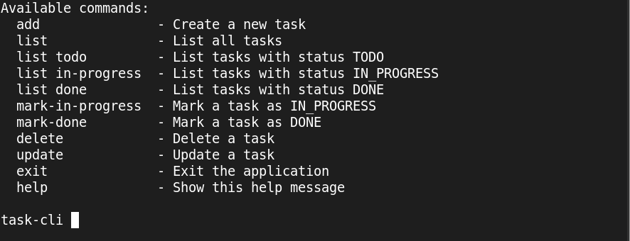

# Task Tracker CLI

Command-line application to manage tasks locally

## Requirements
 - Java 21+

## Build
```
javac -d out src/Main.java src/**/*.java
```

## Run
```
java -cp out Main
```

## Usage
Type `help` inside the CLI to see available commands

